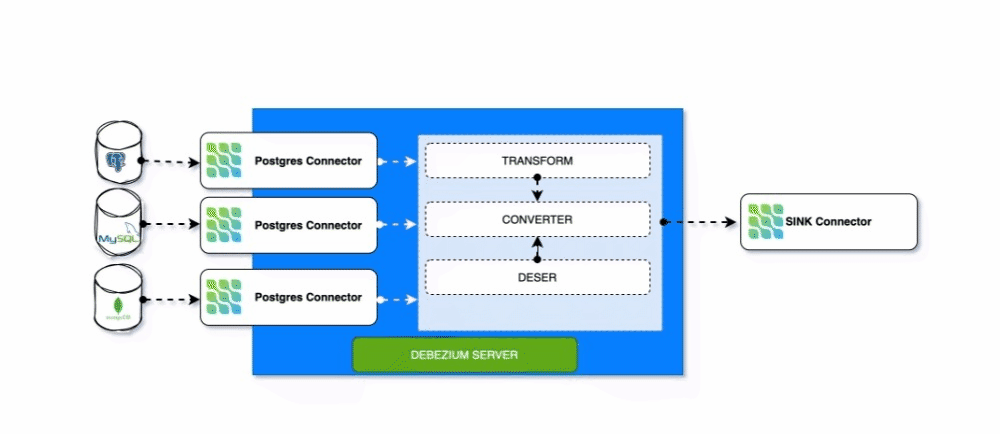

# BigData CDC (Change Data Capture)

# Description
Custom some Debezium classes/libs  by your business logic


## Modules
- Debezium embedded engine
- Debezium transformer
- Debezium signaling
- Debezium schema registry
- Debeizum Serde
- Debezium connector
- Debezium consumer

## How to use
### 1. Build
```shell
mvn clean package -DskipTests
```
### 2. Test with Module cdc-debezium-server
```shell
cd cdc-debezium-server 
run MainApp.java
```

### 2. Setup Debezium Server
Follow via https://debezium.io/documentation/reference/stable/operations/debezium-server.html

### Architecture

